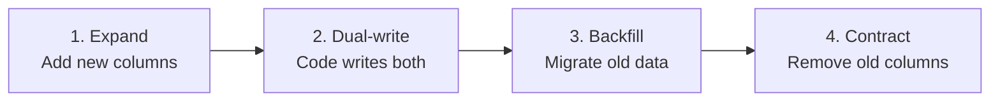

<style>
/* === THE BUILDER === */
section { font-family: 'Inter', system-ui, sans-serif; font-size: 22px; color: #e2e8f0; background: #0f172a; padding: 40px 60px; }
h1 { font-size: 34px; font-weight: 700; color: #f1f5f9; margin-bottom: 12px; }
h2 { font-size: 26px; font-weight: 600; color: #06b6d4; margin-bottom: 10px; }
h3 { font-size: 20px; font-weight: 600; color: #94a3b8; }
strong { color: #22d3ee; }
table { font-size: 17px; border-collapse: collapse; width: 100%; }
th { background: #1e293b; color: #06b6d4; font-weight: 600; padding: 8px 12px; border-bottom: 2px solid #06b6d4; text-align: left; }
td { padding: 6px 12px; border-bottom: 1px solid #334155; }
blockquote { font-size: 19px; border-left: 3px solid #06b6d4; background: #1e293b; padding: 10px 18px; border-radius: 0 6px 6px 0; color: #cbd5e1; }
pre { font-size: 14px; background: #1e293b; border: 1px solid #334155; border-radius: 6px; padding: 14px; line-height: 1.5; }
code { font-size: 14px; font-family: 'JetBrains Mono', 'Cascadia Code', monospace; color: #22d3ee; }
pre code { color: #e2e8f0; }
a { color: #06b6d4; }
header { font-size: 12px; color: #475569; font-family: 'JetBrains Mono', monospace; }
header strong { color: #06b6d4; font-weight: 600; }
footer { font-size: 11px; color: #475569; }
section.title-slide { background: linear-gradient(135deg, #020617 0%, #0f172a 50%, #0c4a6e 100%); color: #fff; display: flex; flex-direction: column; justify-content: center; text-align: center; }
section.title-slide h1 { font-size: 42px; color: #fff; text-shadow: 0 0 40px rgba(6,182,212,0.2); }
section.title-slide h2 { font-size: 22px; color: #67e8f9; font-weight: 400; }
section.title-slide strong { color: #67e8f9; }
section.section-cyan { background: linear-gradient(135deg, #083344 0%, #0e7490 100%); color: #fff; display: flex; flex-direction: column; justify-content: center; }
section.section-green { background: linear-gradient(135deg, #052e16 0%, #15803d 100%); color: #fff; display: flex; flex-direction: column; justify-content: center; }
section.section-purple { background: linear-gradient(135deg, #2e1065 0%, #7c3aed 100%); color: #fff; display: flex; flex-direction: column; justify-content: center; }
section.section-cyan h1, section.section-green h1, section.section-purple h1 { color: #fff; }
section.section-cyan h2 { color: #67e8f9; font-weight: 400; }
section.section-green h2 { color: #86efac; font-weight: 400; }
section.section-purple h2 { color: #c4b5fd; font-weight: 400; }
</style>

<!-- _paginate: false -->
<!-- _class: lead title-slide -->

# Zero-Downtime Database Migrations
## Expand-and-contract pattern for production schemas

**Platform Engineering**
**March 2026**

---

<style scoped>
h1 { font-size: 72px; text-align: center; margin-top: 80px; color: #f87171; }
p { text-align: center; font-size: 22px; color: #94a3b8; }
</style>

# 73%

of production outages involve a database change gone wrong

---

<!-- _paginate: false -->
<!-- _class: lead title-slide -->

# Agenda

### Part 1: Why migrations break things
Lock contention, rollback hell, data loss

### Part 2: The expand-and-contract pattern
Additive changes, dual-write, batched backfill

### Part 3: Results and tooling
Before/after metrics, automation

---

<!-- _header: "" -->
<!-- _class: lead section-cyan -->

# Part 1: Why migrations break things

**The gap between staging and production is measured in row counts**

---

<!-- header: "**The problem** · The pattern · Results" -->

# What goes wrong

- **Locking**: `ALTER TABLE` acquires exclusive lock - all reads and writes block
- **Timeouts**: Migration takes 47 min on 200M rows, connections pile up, cascade failure
- **Rollback**: Old schema is gone, old code can't talk to new schema - no undo
- **Split-brain**: Half the pods see old schema, half see new during rolling deploys
- **Data loss**: Column drops, type changes, constraints that reject existing rows

> Every one of these has caused a real outage. Usually Friday at 5pm.

---

# Naive approach vs reality

| Step | Expectation | Reality |
|------|-------------|---------|
| Run migration | Seconds | 47 minutes on 200M rows |
| App restart | Picks up new schema | Half pods old, half new |
| Rollback | Revert the migration | Can't - data transformed |
| Alert fires | Quick fix | 3am page, 2-hour incident |

---

<!-- _header: "" -->
<!-- _class: lead section-green -->

# Part 2: Expand and contract

**Make every migration step independently reversible**

---

<!-- header: "The problem · **The pattern** · Results" -->

# Four phases, all backwards-compatible



The key: you never make a breaking change. If anything fails, stop - the old path still works.

---

# Phase 1: Expand (add, never remove)

```sql
-- Safe: nullable column, no lock contention
ALTER TABLE users ADD COLUMN email_verified boolean;

-- Safe: new table, no impact on existing queries
CREATE TABLE user_preferences (
  user_id  bigint REFERENCES users(id),
  theme    varchar(50) DEFAULT 'light',
  locale   varchar(10) DEFAULT 'en-US'
);

-- NEVER in expand phase:
-- ALTER TABLE users DROP COLUMN legacy_status;
-- ALTER TABLE users ALTER COLUMN name SET NOT NULL;
```

**Rules**: Only additive. New columns must be `NULL`able or have defaults. No `NOT NULL` until backfill completes.

---

# Phase 2: Dual-write

```typescript
async function updateUser(id: string, data: UpdatePayload) {
  await db.query(`
    UPDATE users SET
      name = $1,
      email_verified = $2,   -- new column
      legacy_verified = $2   -- old column (kept in sync)
    WHERE id = $3
  `, [data.name, data.verified, id]);

  // Read from new column
  return db.query(
    `SELECT id, name, email_verified as verified FROM users WHERE id = $1`,
    [id]
  );
}
```

> Deploy this code *before* backfill. Order matters - new writes go to both columns from this point forward.

---

# Phase 3: Backfill in batches

```typescript
async function backfill(batchSize = 1000) {
  let cursor = 0;
  while (true) {
    const batch = await db.query(`
      UPDATE users SET email_verified = legacy_verified
      WHERE id > $1 AND email_verified IS NULL
      ORDER BY id LIMIT $2 RETURNING id
    `, [cursor, batchSize]);

    if (batch.rows.length === 0) break;
    cursor = batch.rows.at(-1).id;
    await sleep(100);  // throttle - don't slam the DB
  }
}
```

**Why batches?** Single `UPDATE` on 200M rows locks the table. 1,000-row batches with 100ms pauses keep p99 latency flat.

---

<!-- _header: "" -->
<!-- _class: lead section-purple -->

# Part 3: Results

**What changes when migrations become boring**

---

<!-- header: "The problem · The pattern · **Results**" -->

# Before vs after

| Metric | Before | After | Change |
|--------|--------|-------|--------|
| Outages from migrations | 3/quarter | 0 in 12 months | **-100%** |
| Migration downtime | 47 min avg | 0 seconds | **→ Zero** |
| Rollback time | 2+ hours | Instant (stop dual-write) | **-99%** |
| Friday deploy anxiety | High | None | **Priceless** |

---

# Key takeaways

1. **Never make breaking schema changes** - expand first, contract last
2. **Dual-write before backfill** - no data falls through the gap
3. **Batch everything** - small writes, throttled, with progress tracking
4. **Rollback = stop the process** - every step is backwards-compatible
5. **Boring is the goal** - the best migration is the one nobody notices

---

<!-- _paginate: false -->
<!-- _class: lead title-slide -->

# Questions?

**Platform Engineering** · #platform-eng
