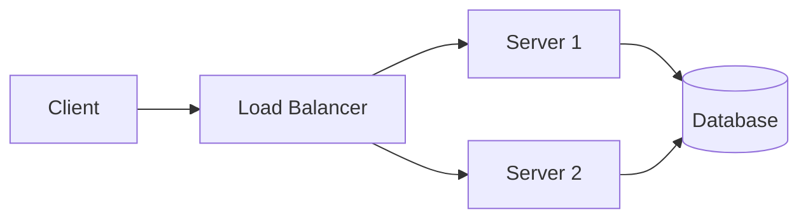

# Marp Syntax & Directives Reference

Complete reference for Marp's extended Markdown syntax. Consult this whenever generating or editing a deck.

## Table of Contents
1. [Slide Basics](#slide-basics)
2. [Directives](#directives)
3. [Image Syntax](#image-syntax)
4. [Background Images](#background-images)
5. [Code Blocks](#code-blocks)
6. [Math Typesetting](#math-typesetting)
7. [Fragmented Lists](#fragmented-lists)
8. [Slide Transitions](#slide-transitions)
9. [Scoped Styles](#scoped-styles)
10. [Mermaid Diagrams](#mermaid-diagrams)
11. [Speaker Notes](#speaker-notes)
12. [Auto-Scaling](#auto-scaling)
13. [Common Pitfalls](#common-pitfalls)

---

## Slide Basics

Slides are separated by `---` (horizontal rule). Each slide is rendered as a `<section>` element.

```markdown
---
marp: true
---

# Slide 1

Content here

---

# Slide 2

More content
```

The first `---` pair is the YAML frontmatter. Subsequent `---` are slide separators.

---

## Directives

Directives control slide behavior. They can be **global** (apply to all slides) or **local** (apply from that slide onward) or **scoped** (apply to one slide only, prefixed with `_`).

### Global Directives (in frontmatter)

```yaml
---
marp: true
theme: default          # default | gaia | uncover | custom
paginate: true          # Show slide numbers
size: 16:9              # 16:9 | 4:3 | custom WxH
math: mathjax           # Enable math: mathjax | katex
header: "Deck Title"    # Persistent header on all slides
footer: "© 2026 Name"  # Persistent footer on all slides
style: |                # Inline CSS (alternative to <style> block)
  section { background: #fff; }
backgroundColor: "#fff" # Shorthand for background color
backgroundImage: "url('bg.png')"
---
```

### Local Directives (HTML comments, apply from this slide onward)

```markdown
<!-- theme: gaia -->
<!-- paginate: true -->
<!-- header: "Section Name" -->
<!-- footer: "Page footer" -->
<!-- class: invert -->
<!-- backgroundColor: "#1a1a2e" -->
<!-- color: "#eee" -->
```

### Scoped Directives (underscore prefix, this slide ONLY)

```markdown
<!-- _class: lead -->
<!-- _header: "" -->
<!-- _footer: "" -->
<!-- _paginate: false -->
<!-- _backgroundColor: "#000" -->
<!-- _color: "#fff" -->
```

### Key Directive Patterns

**Hide pagination on title slides:**
```markdown
<!-- _paginate: false -->
<!-- _class: lead title-slide -->
# My Talk Title
```

**Reset header before section dividers:**
```markdown
<!-- _header: "" -->
<!-- _class: lead section-intro -->
# Part 2: Architecture
```

**Set breadcrumb for a section's content slides:**
```markdown
<!-- header: "Context · **Architecture** · Results" -->
# Component Overview
```

The `header` directive (without underscore) persists until changed. Set it once on the first content slide of each section.

---

## Image Syntax

Marp extends standard Markdown image syntax with keywords.

### Resizing

```markdown


       <!-- shorthand -->
             <!-- percentage of slide width -->
```

### Filters

Apply CSS filters directly in alt text:

```markdown


```

Combine multiple: ``

---

## Background Images

Use the `bg` keyword to set slide backgrounds. This is one of Marp's most powerful features.

### Full Background

```markdown
                    <!-- fills entire slide -->
        <!-- dimmed background -->
     <!-- darkened background -->
```

### Split Layout (image on one side, content on other)

```markdown


# Content on the right side

- Bullet 1
- Bullet 2
```

Split options: `left`, `right`, `left:30%`, `right:60%`, etc.

### Contain vs Cover

```markdown
    <!-- fit entirely within slide, may have margins -->
        <!-- fill slide, may crop -->
        <!-- alias for contain -->
```

### Multiple Backgrounds (side by side)

```markdown


```

Multiple `bg` images tile horizontally by default. Combine with `vertical`:

```markdown


```

### Background Color

Use directives instead of image syntax:
```markdown
<!-- _backgroundColor: "#1a1a2e" -->
```

Or with gradients in CSS:
```css
section.dark-slide {
  background: linear-gradient(135deg, #0f172a 0%, #1e293b 100%);
}
```

---

## Code Blocks

Standard fenced code blocks with syntax highlighting:

````markdown
```javascript
const greeting = "Hello, World!";
console.log(greeting);
```
````

### Code Sizing

Control code font size with scoped styles:

```markdown
<style scoped>
pre { font-size: 14px; }
</style>
```

Or set globally in the theme CSS:
```css
pre { font-size: 16px; }
code { font-size: 14px; }
```

### Line Highlighting (not native - use visual emphasis)

Marp doesn't support line highlighting natively. Alternatives:
- Use comments like `// <-- THIS LINE` to draw attention
- Bold the key parts in surrounding text
- Split into smaller blocks with explanation between them

---

## Math Typesetting

Enable in frontmatter: `math: mathjax` or `math: katex`

### Inline Math
```markdown
The formula $E = mc^2$ describes energy-mass equivalence.
```

### Block Math
```markdown
$$
\frac{n!}{k!(n-k)!} = \binom{n}{k}
$$
```

---

## Fragmented Lists

In Marp's HTML output (bespoke template), lists using `*` or `1)` markers appear one item at a time (like PowerPoint animations). Lists using `-` or `1.` appear all at once.

```markdown
# Animated list (items appear one by one in HTML presentation)
* First point
* Second point
* Third point

# Static list (all visible immediately)
- First point
- Second point
- Third point
```

**Recommendation**: Use `-` (static) by default. Use `*` (fragmented) only for deliberate reveal sequences in live presentations. Fragmented lists only work in HTML bespoke template - they have no effect in PDF/PPTX.

---

## Slide Transitions

Available in HTML output only. Set via directive:

```markdown
<!-- transition: fade -->
```

### Built-in Transitions

| Transition | Effect |
|-----------|--------|
| `fade` | Cross-fade |
| `slide` | Slide left |
| `slide-up` | Slide up |
| `wipe` | Wipe left to right |
| `zoom` | Zoom in |
| `iris-in` | Circular reveal inward |
| `iris-out` | Circular reveal outward |
| `swoosh` | Swoosh effect |

### Per-slide Transition

```markdown
<!-- _transition: zoom -->
# This slide zooms in
```

### Recommendation

Use transitions sparingly. A subtle `fade` globally is usually enough. Heavy transitions distract from content. Only use dramatic transitions (zoom, swoosh) for intentional emphasis moments.

---

## Scoped Styles

### Global styles (all slides)

Place `<style>` block after frontmatter:

```html
<style>
section {
  font-family: 'Helvetica Neue', sans-serif;
  font-size: 22px;
}
h1 { color: #2563eb; }
</style>
```

### Scoped styles (current slide only)

```html
<style scoped>
h1 { font-size: 48px; color: #ef4444; }
p { font-size: 28px; }
</style>
```

Scoped styles are powerful for making one slide visually distinct (e.g., a big stat callout slide) without affecting the rest.

---

## Mermaid Diagrams

Mermaid renders natively in Marp HTML output when `--html` flag is used. Wrap in standard fenced code blocks:

````markdown

````

### Supported Diagram Types

| Type | Declaration | Best for |
|------|------------|----------|
| Flowchart | `graph TD` / `graph LR` | Architecture, decision trees |
| Sequence | `sequenceDiagram` | API flows, interactions |
| Class | `classDiagram` | Object models |
| State | `stateDiagram-v2` | State machines |
| ER | `erDiagram` | Data models |
| Gantt | `gantt` | Timelines, roadmaps |
| Pie | `pie` | Simple proportions |
| Git | `gitgraph` | Branch strategies |

### Mermaid Sizing

Mermaid diagrams can overflow. Control with scoped styles:

```html
<style scoped>
.mermaid { transform: scale(0.8); }
</style>
```

### Mermaid in PDF/PPTX

Mermaid does NOT render in PDF/PPTX export. For those formats, pre-render to SVG:

```bash
# Install mermaid-cli
npx @mermaid-js/mermaid-cli@latest -i diagram.mmd -o diagram.svg -t neutral -b transparent
```

Then embed the SVG:
```markdown

```

Strategy: Always write Mermaid inline for the HTML version. If the user needs PDF/PPTX, add a pre-render step in the export pipeline.

---

## Speaker Notes

Speaker notes use HTML comments and appear in Marp's presenter view (press `p` in HTML presentation):

```markdown
# Slide Title

Content visible to audience.

<!--
These are speaker notes - only visible in presenter view.

Key points to mention:
- Elaborate on the main metric
- Transition: "This naturally leads us to..."
- [Target: ~2 minutes on this slide]
-->
```

### Presenter View

In HTML output, press `p` to open presenter view in a separate window. Shows:
- Current slide
- Next slide preview
- Speaker notes
- Timer

---

## Auto-Scaling

Marp's `default` and `gaia` themes support auto-scaling for headings and code blocks. If text is too large for the slide, it shrinks automatically.

To enable for custom themes, add to CSS:
```css
@auto-scaling true;
```

### Manual Fitting

Use Marp's `<!-- fit -->` directive for headings:

```markdown
# <!-- fit --> This Long Heading Will Shrink to Fit the Slide
```

---

## Common Pitfalls

1. **Forgetting `--no-stdin`** - Marp CLI hangs indefinitely without it. Always include it.
2. **Missing `--html` flag** - `<style>` blocks and Mermaid won't work without `--html`.
3. **Scoped directive vs persistent directive** - `_header` (with underscore) is one slide only. `header` (no underscore) persists until changed. Forgetting this causes wrong headers on slides.
4. **Frontmatter must be first** - No blank lines before the opening `---`.
5. **Image paths in export** - Use `--allow-local-files` when exporting PDF/PPTX with local images.
6. **Code block overflow** - Long lines don't wrap in code blocks. Keep lines under 60 chars or reduce font size.
7. **Mermaid in PPTX** - Doesn't render. Must pre-render to SVG.
8. **Table sizing** - Large tables overflow. Keep to 5 rows max, or use `font-size: 16px` in scoped styles.
9. **CSS class names** - `<!-- _class: my-class -->` must match a `section.my-class` rule in your CSS. Typos silently fail.
10. **Multiple `<style>` blocks** - Marp merges them, but order matters. Put global styles first, scoped later.
