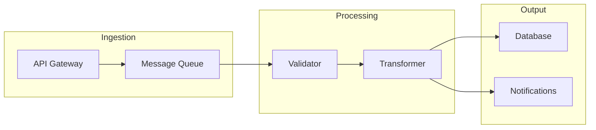
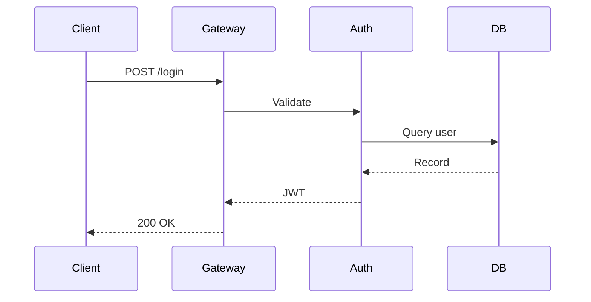

# Slide Layout Patterns

Reusable patterns for common slide types. Each pattern notes which archetypes favor it most.

---

## Title Slides

### Standard Title
```markdown
<!-- _paginate: false -->
<!-- _class: lead title-slide -->

# Presentation Title
## Subtitle or tagline

**Speaker Name** · Role
**Date** · Event/Context
```

### Title with Key Metric (Builder, Operator)
```markdown
<!-- _paginate: false -->
<!-- _class: lead title-slide -->

# Presentation Title
## Subtitle

**Key metric**: 10x improvement in deployment speed
**Team**: Platform Engineering · **Q1 2026**
```

### Hero Title (Storyteller)
```markdown
<!-- _paginate: false -->
<!-- _class: lead title-slide -->


# One Bold Statement
## That makes people lean in
```

---

## Section Dividers

```markdown
<!-- _header: "" -->
<!-- _paginate: false -->
<!-- _class: lead section-NAME -->

# Part N: Section Title

**One-line description or key question**
```

Always reset header (`_header: ""`) before section dividers.

---

## Content Slides

### Bullet List
```markdown
<!-- header: "Context · **Architecture** · Results" -->

# Slide Title

- First point with enough detail to stand alone
- Second point - include the "so what"
- Third point with **bold emphasis** on key phrase
```
*Builder: 5-7 bullets OK. Operator: max 4 with bold lead-ins. Storyteller: max 3. Educator: max 4, complete sentences.*

### Two-Column (Image Split)
```markdown
# Left: Explanation


- Point about the diagram
- Another observation
- Key takeaway in **bold**
```

### Two-Column (Table)
```markdown
# Comparison

| Before | After |
|--------|-------|
| Manual deployments | Automated CI/CD |
| 2-hour rollback | 30-second rollback |
| Monthly releases | Daily releases |
```

### Big Number / Stat Callout
```markdown
<style scoped>
h1 { font-size: 96px; text-align: center; margin-top: 80px; }
p { text-align: center; font-size: 24px; color: #64748b; }
</style>

# **4.2s**

Average response time - down from 12s after the migration
```
*Storyteller: use liberally (metrics as trophies). Builder: only for system metrics. Operator: for business KPIs.*

### Quote / Callout
```markdown
# Key Insight

> The bottleneck isn't writing features - it's shipping them safely.
> Every hour on manual testing is an hour not spent building.

This shifts the challenge from **development** to **delivery**.
```

### Image with Annotation
```markdown
# System Overview


**Key components:**
- API Gateway handles auth + routing
- Worker pool scales horizontally
- Cache layer reduces DB load by 80%
```

### Timeline / Process Flow
```markdown
# Migration Path

| Phase | Timeline | Deliverable |
|-------|----------|-------------|
| **1. Audit** | Week 1-2 | Dependency map + risk assessment |
| **2. Scaffold** | Week 3-4 | New service skeleton + CI |
| **3. Migrate** | Week 5-8 | Traffic shift 10% → 100% |
| **4. Cleanup** | Week 9-10 | Old service teardown |
```

### Icon + Text Rows
```markdown
# Why this approach?

🔧 **Simple to operate** - One config file, zero runtime dependencies

📦 **Portable** - Deploy anywhere: Docker, bare metal, serverless

⚡ **Fast** - Sub-second cold starts, no JVM warmup
```

### Pros/Cons Tradeoff Table
```markdown
# Monolith vs Microservices

| | Monolith | Microservices |
|---|-----------|--------|
| **Setup** | Hours | Weeks |
| **Debugging** | Stack traces | Distributed tracing |
| **Deployment** | All-or-nothing | Independent |
| **Scaling** | Vertical | Horizontal |

> **Recommendation**: Start monolith, extract when you hit clear bottlenecks
```

---

## Data Slides

### Before / After (Operator, Storyteller)
```markdown
# Impact

| Metric | Before | After | Change |
|--------|--------|-------|--------|
| Deploy frequency | Monthly | Daily | **+30x** |
| Lead time | 3 weeks | 2 hours | **-99%** |
| Error rate | 4.2% | 0.3% | **-93%** |
```

### Multiple Stats (Storyteller)
```markdown
<style scoped>
h2 { color: #2563eb; font-size: 48px; margin: 4px 0; }
p { margin: 0 0 24px 0; }
</style>

## 50,000+
Requests per second at peak

## <200ms
P99 latency across all endpoints

## 99.97%
Uptime over the last 12 months
```

---

## Code Slides (Builder)

### Code + Explanation
````markdown
# Rate Limiting with Redis

```typescript
async function checkRateLimit(userId: string): Promise<boolean> {
  const key = `ratelimit:${userId}:${getCurrentMinute()}`;
  const count = await redis.incr(key);
  if (count === 1) await redis.expire(key, 60);
  return count <= MAX_REQUESTS_PER_MINUTE;
}
```

**Why Redis?** Sub-millisecond reads, atomic `INCR`, and automatic key expiry.
````

### Code + Visual Output
```markdown
# Pipeline in Action


```python
pipeline = (
    Validator()
    | Transformer()
    | Enricher()
    | Publisher()
)
result = await pipeline.run(event)
```
```

---

## Diagram Slides (Builder, Educator)

### Architecture (Mermaid)
````markdown
# System Architecture


````

### Sequence Diagram
````markdown
# Authentication Flow


````

---

## Teaching Slides (Educator)

### Concept + Analogy
```markdown
# What is a load balancer?

> Think of it like a host at a restaurant - they don't cook your food,
> they just make sure every table gets served and no waiter is overwhelmed.

**In technical terms:** distributes incoming requests across multiple servers to prevent any single server from becoming a bottleneck.
```

### Progressive Reveal (fragmented list)
```markdown
# What happens during a cache miss?

* 1. Client requests data from the API
* 2. API checks the cache - empty
* 3. API queries the database (slower)
* 4. Result written to cache for next time
* 5. Client gets the response
```

### Recap / Checkpoint
```markdown
<!-- _class: recap -->

# ✓ What we've covered so far

1. **Caching** reduces database load by serving repeated reads from memory
2. **TTL** controls how long cached data stays fresh
3. **Cache invalidation** is the hard part - we'll tackle that next

> Next up: What happens when cached data goes stale?
```

---

## Closing Slides

### Key Takeaways (all archetypes)
```markdown
# Key takeaways

1. **Start with the bottleneck** - measure before you optimize
2. **Automate the boring parts** - save human judgment for decisions
3. **Build for observability** - you can't fix what you can't see
```

### The Ask (Storyteller)
```markdown
<!-- _class: lead title-slide -->

# We're raising $5M to scale this to 10,000 customers

**What we need**: Lead investor for Series A
**Timeline**: Closing Q2 2026
**Contact**: founder@company.com
```

### Next Steps (Operator)
```markdown
<!-- _class: lead title-slide -->

# Recommended next steps

**This week**: Review RFC, share feedback in #platform-eng
**Next sprint**: POC with pilot team (3 services)
**Q2 target**: Full rollout, decommission legacy
```

### Q&A / Contact
```markdown
<!-- _paginate: false -->
<!-- _class: lead title-slide -->

# Thank You

**Name** · Title
name@company.com · @handle
Slides: `github.com/user/deck-name`
```

---

## Layout Variety Rules

**Never repeat the same layout on consecutive slides.** Alternate between:
bullet list → table → diagram → code → big number → image split

**The squint test**: If two consecutive slides look the same shape when squinted, change one.

**Rhythm**: Alternate dense slides (tables, code) with breathing-room slides (stat, quote). The audience needs cognitive breaks.
